# Maximum/Best Matching   

[TOC]

## 1. Abstract  
This project is mainly focus on two different algorithms to find out the maximum matching/best matching of bipartite graph.  In this project, all input data will be stored as a graph.    
The first algorithm is based on Deep First Search and I implemented the source code specifically for bipartite graph. The second algorithm is based on Hungarian Algorithm and is adopted from Amir Bawab[1] for completed graph.   

## 2. Introduction 
#### Maximum Matching:  
Maximum Matching is a set of edges without common vertices. As a matching problem, it is often concerned with bipartite graphs which is also the focus of this project.  
    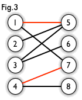   

#### Best Matching:  
Best Matching is a set of edges which will satisfy the standard. In this project, the Hungarian Algorithm is used to find the match which the sum of weight is minimum.  

####  Bipartite Graph[2]：  
Bipartite Graph is a graph whose vertices can be divided into two disjoint and independent sets U and V such that every edge connects a vertex in U to one in V.   
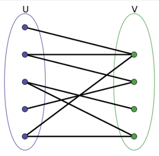  

#### Deep First Search:  
- Original Bipartite Graph:   
    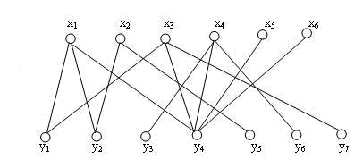  
- Find the first edge:  
    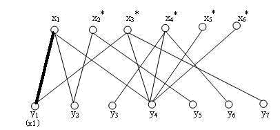  
- Find the second edge:  
    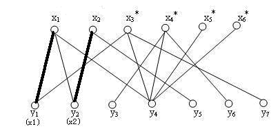  
- If the connected edge's vertex is already matched, test if there is another choice for that vertex. If so, change the edge and link current vertex with last test vertex:  
    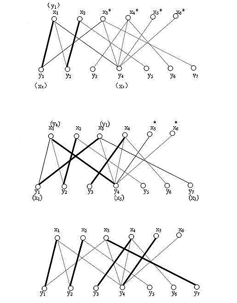  
- Conclusion: In this algorithm, the main point is using deep first search to test each vertex and augment path. Since the goal is to find the maximum matching of the bipartite graph. Therefore, search each vertex, once it is found the connected vertex is already matched. Then test if this matched vertex has other possible augment path, if so, then can connect this vertex with current vertex and that means the number of edge will plus one.   
  
#### Hungarian Algorithm[3]:
- Subtract row minima:   
  For each row, find the lowest element and subtract it from each element in that row.    
- Subtract column minima:  
  Similarly, for each column, find the lowest element and subtract it from each element in that column.  
- Cover all zeros with a minimum number of lines:  
  Cover all zeros in the resulting matrix using a minimum number of horizontal and vertical lines. If *n* lines are required, an optimal assignment exists among the zeros. The algorithm stops. If less than *n* lines are required, continue with Step 4.   
- Create additional zeros:   
  Find the smallest element (call it *k*) that is not covered by a line in Step 3. Subtract *k* from all uncovered elements, and add *k* to all elements that are covered twice.  
- Conclusion:  Since in this project, I focus on unweighted bipartite graph. Therefore, the bipartite graph I build is based on the original algorithm with weighted graph. If two vertexes are connected, then set the value as 0, otherwise set it as 1. Then the algorithm will find the smallest weight as 0 and find out the maximum matching.  

    
## 3. Key Implementation  
- Build Bipartite
```java
bipartite = new int[num + 1][num + 1];
for(int i = 1; i <= num; i++)
{
   	for(int j = 1; j <= num; j++)
	{
      	bipartite[i][j] = 0;
     }
}

while((line = bufferedReader.readLine()) != null)
{
    String str[] = line.split(" ");
    int firstNum = Integer.parseInt(str[0]);
    int secondNum = Integer.parseInt(str[1]);

    bipartite[firstNum][secondNum] = 1;
    bipartite[secondNum][firstNum] = 1;
}
```

- Find Augment Path  
```java
// findAugmentPath: to find the augment path of vertex i
// if there is one, then return true; otherwise, return false
boolean findAugmentPath(int v)
{
   for(int i = 1; i <= num; i++)
   {
       // if connected
       if(bipartite[v][i] == 1)
       {
           // if not visited
           if(visited[i] == false)
           {
              visited[i] = true;
              // if i is not matched with others, then match them
              // if i is matched with j, then test if j can change to another vertex
              if(match[i] == -1 || findAugmentPath(match[i]))
              {
                  match[v] = i;
                  match[i] = v;
                  return true;
              }
           }
        }
    }
    return false;
}
```

## 4. Experimental Results  
- test_data —— test0.txt：  
    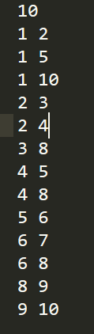  
    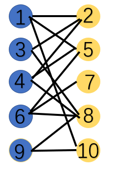  
- Deep First Search —— Maximum Matching for Bipartite Graph:  
    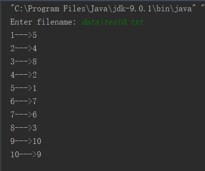  
    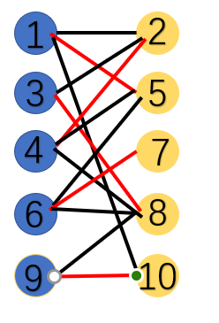  
- Hungarian Algorithm —— Minimum Matching for Completed Graph:  
      
    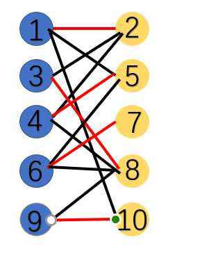  

## 5. Conclusions  
The difference of the above algorithm is that the first algorithm is used for unweighted bipartite graph to find out the maximum matching. It is possible that some of vertex may not be matched with others. Though this algorithm use Deep First Search which requires longer time and larger space, it can ensure that the result turns out to be the best. The second algorithm Hungarian Algorithm is mentioned in the class and is used for weighted completed graph to find out he best matching with the minimum sum of weight.   


## 6. References 

[1] :  https://github.com/amirbawab/Hungarian-Algorithm	"Hungarian-Algorithm Java Implementation"   
[2] : https://en.wikipedia.org/wiki/Bipartite_graph	"Bipartite Graph"   
[3] : http://www.hungarianalgorithm.com/index.php "Hungarian Algorithm"   


